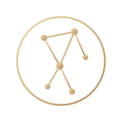

  

<h1 align="center">Lyrahcle</h1>

<b>Constellation Analytics — Never Lies</b>

Space cybersecurity operations, from ground station to orbit.

---

## What we build

Lyrahcle is a space cybersecurity operations platform combining orbital awareness, RF/SDR telemetry, TM/TC decoding, threat intelligence, and incident response in one operator-focused product. It's built for defenders working across ground stations, satellite operators, and space programs who need visibility into RF and orbital threats the way SOC teams have visibility into networks.

- **Orbital awareness** — live satellite tracking, TLE sync, pass prediction.
- **RF & signal assurance** — SDR ingestion, anomaly detection, replay/spoofing indicators, IQ forensic capture.
- **Protocol intelligence** — AX.25, CCSDS, PUS, CSP decoding.
- **Threat intelligence** — NVD-backed space CVE tracking mapped to assets.
- **Operations** — RBAC, WebAuthn/TOTP auth, mTLS agent fleet management, audit logging, incident workflows.
- **Built for compliance** — designed against IEEE P3536 (Space System Cybersecurity Design), with SBOMs, signed releases, and a public threat model.

## Model

Lyrahcle follows an **Open Core** model:

| | |
|---|---|
| **Core** | AGPLv3 — backend, dashboard, SDR agent, CVE sync worker |
| **Enterprise modules** | Proprietary — advanced RF, protocol decoders, reporting, integrations |
| **Shared libraries** | MIT |
| **Documentation** | CC BY-SA 4.0 |

## Status

Pre-v1.0, under active hardening.

## Contact

- **Email:** manu.ciberseguridad@gmail.com
- **Founder & CEO:** Manuel López-Serrano Fabuel

Founder & CEO — Manuel López-Serrano Fabuel

